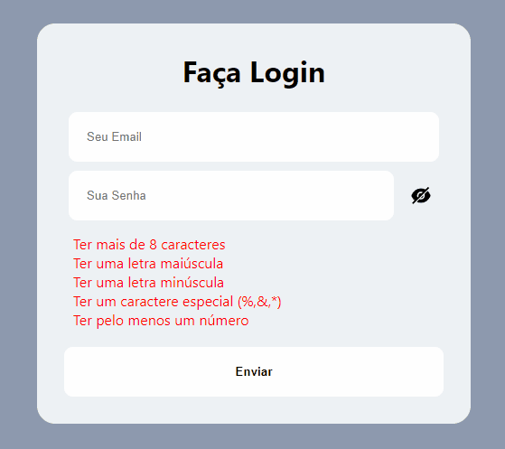

# Seja bem vindo a um dos meus #JokeCodes
Nesse código vou te mostrar como fazer uma validação de senha no Front-End, **com feedback na tela de login!**, usando React e mais nadinha!

**OBS: Nesse repositório também tem um Workflow para fazer auto-deploy de aplicações React**



## Como usar esse repositório?
Basta clonar o repositório para o seu computador, abrir a pasta, rodar `npm install` e depois rodar `npm start` para abrir o projeto no seu `localhost:xxxx`, e prontinho!

## Como isso foi feito?

### JSX
A primeira coisa é criar os elementos da tela, para esse login eu criei um título, dois campos, um de email e um de senha, e uma lista para armazenar os textos com o que a senha precisa ter pra ser válida.

```
    <div className='App'>
      <div className='Login'>
        <h3>Faça Login</h3>
        <div className='Login__inputs'>
          <input type={'email'} placeholder="Seu Email"></input>
          <div className='Password'>
            <input value={passValue} onChange={({target}) => {setPassValue(target.value)}} type={view ? 'text' : 'password'} placeholder="Sua Senha"></input>
            {view ? <AiFillEye className='icon' onClick={() => setView(!view)}/> : <AiFillEyeInvisible className='icon' onClick={() => setView(!view)}/>}
          </div>

          <ul className='Inputs__checks'>
            <li className={validated.length ? 'true' : 'false'}>Ter mais de 8 caracteres</li>
            <li className={validated.upper ? 'true' : 'false'}>Ter uma letra maiúscula</li>
            <li className={validated.lower ? 'true' : 'false'}>Ter uma letra minúscula</li>
            <li className={validated.special ? 'true' : 'false'}>Ter um caractere especial (%,&,*)</li>
            <li className={validated.number ? 'true' : 'false'}>Ter pelo menos um número</li>
          </ul>

          <button type={'button'} className='Inputs__button'>Enviar</button>
        </div>
      </div>
    </div>
```

Uma coisa interessante para aprender aqui é o botão de **Mostrar/Ocultar** a senha, eu fiz isso criado um state chamado **view**, quando esse state está `true` eu exibo o icone de um olho normal, e altero o campo de senha para o tipo `text`, e quando o state está `false` o campo de senha volta para o tipo `password` e o icone de um olho cortado aparece.

```
          <div className='Password'>
            <input value={passValue} onChange={({target}) => {setPassValue(target.value)}} type={view ? 'text' : 'password'} placeholder="Sua Senha"></input>
            {view ? <AiFillEye className='icon' onClick={() => setView(!view)}/> : <AiFillEyeInvisible className='icon' onClick={() => setView(!view)}/>}
          </div>
```

### SCSS
Para esse projeto eu usei o **SCSS**, que me permite aninhar as classes assim como aninhamos componentes no JSX.

### Javascript, finalmente!
Aqui que vem a magia, a primeira coisa para fazer essa validação é criar as validações, para isso, eu vou usar **RegEx**, da uma olhada:
```
const validations = {
  lower: new RegExp('(?=.*[a-z])'),
  upper: new RegExp('(?=.*[A-Z])'),
  number: new RegExp('(?=.*[0-9])'),
  special: new RegExp('(?=.*[!@#\$%\^&\*])'),
  length: new RegExp('(?=.{8,})')
}
```

Depois que eu criei um **Objeto que armazena os RegEx de validação** eu vou criar um Objeto que armazena **se o resultado foi true ou falso** de acordo com cada validação.
```
  const [validated, setValidated] = useState({
    lower: false,
    upper: false,
    number: false,
    special: false,
    length: false
  })
```

#### Agora vem a magia!
Usando o **useEffect** com `passValue` que é meu state que armazena o vlaor do input da senha como **dependência do useEffect**, eu vou fazer a validação da seguinte forma:

Antes de tudo, eu vou pegar o meu objeto que armazena se o resultado foi true ou falso, e vou criar uma cópia dele dentro do meu **useEffect**, para que eu possa alterar os valores direto no objeto sem usar a função de `set` do `useState`:
```
useEffect(() => {
    const tempValidated = validated;
    
    //...
    }, [passValue])
```

Primeiro, eu vou fazer um **Map** no Object.entries do meu objeto de validações:
```
Object.entries(validations).map((obj) => {
    // ...
})
```

Segundo, eu separo a key do valor RegEx:
```
Object.entries(validations).map((obj) => {
    // key vai ser por exemplo number
    const key = obj[0]
    // val vai ser por exemplo o RegEx de number que é /(?=.*[0-9])/
    const val = obj[1]
  
  // ...
})
```

**Terceiro, e último, eu faço os testes!**
Para cada validação do objeto de validações, eu vou fazer um `val.test(passValue)` para verificar se a senha passa naquele **RegEx**:
```
      if(val.test(passValue)) {
        tempValidated[key] = true;
      } else {
        tempValidated[key] = false;
      }
```

### E é assim que se faz!

Agora para finalizar, eu seto o meu objeto que salva os true e false das validações que está no **useState**, e o código fica assim:
```
  useEffect(() => {
    const tempValidated = validated;

    Object.entries(validations).map((obj) => {
      const key = obj[0]
      const val = obj[1]

      if(val.test(passValue)) {
        tempValidated[key] = true;
      } else {
        tempValidated[key] = false;
      }
    })

    setValidated(tempValidated);
  }, [passValue])
```